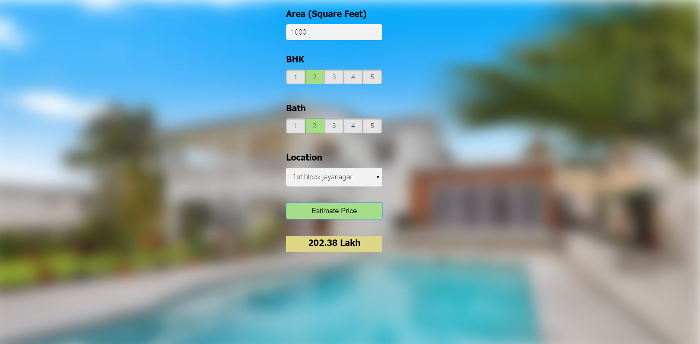

This data science project series walks through step by step process of how to build a real estate price prediction website. We will first build a model using sklearn and linear regression using banglore home prices dataset from kaggle.com. Second step would be to write a python flask server that uses the saved model to serve http requests. Third component is the website built in html, css and javascript that allows user to enter home square ft area, bedrooms etc and it will call python flask server to retrieve the predicted price. During model building we will cover almost all data science concepts such as data load and cleaning, outlier detection and removal, feature engineering, dimensionality reduction, gridsearchcv for hyperparameter tunning, k fold cross validation etc. Technology and tools wise this project covers,

1. Python
2. Numpy and Pandas for data cleaning
3. Matplotlib for data visualization
4. Sklearn for model building
5. Jupyter notebook, visual studio code and pycharm as IDE
6. Python flask for http server
7. HTML/CSS/Javascript for UI

# Deploy this app to cloud (AWS EC2)

1. Create EC2 instance using amazon console, also in security group add a rule to allow HTTP incoming traffic
2. Now connect to your instance using a command like this,
```
ssh -i "C:\Users\Viral\.ssh\Banglore.pem" ubuntu@ec2-3-133-88-210.us-east-2.compute.amazonaws.com
```
3. nginx setup
   1. Install nginx on EC2 instance using these commands,
   ```
   sudo apt-get update
   sudo apt-get install nginx
   ```
   2. Above will install nginx as well as run it. Check status of nginx using
   ```
   sudo service nginx status
   ```
   3. Here are the commands to start/stop/restart nginx
   ```
   sudo service nginx start
   sudo service nginx stop
   sudo service nginx restart
   ```
   4. Now when you load cloud url in browser you will see a message saying "welcome to nginx" This means your nginx is setup and running.
4. Now you need to copy all your code to EC2 instance. You can do this either using git or copy files using winscp. We will use winscp. You can download winscp from here: https://winscp.net/eng/download.php
5. Once you connect to EC2 instance from winscp (instruction in a youtube video), you can now copy all code files into /home/ubuntu/ folder. The full path of your root folder is now: **/home/ubuntu/BangloreHomePrices**
6.  After copying code on EC2 server now we can point nginx to load our property website by default. For below steps,
    1. Create this file /etc/nginx/sites-available/bhp.conf. The file content looks like this,
    ```
    server {
	    listen 80;
            server_name bhp;
            root /home/ubuntu/BangloreHomePrices/client;
            index app.html;
            location /api/ {
                 rewrite ^/api(.*) $1 break;
                 proxy_pass http://127.0.0.1:5000;
            }
    }
    ```
    2. Create symlink for this file in /etc/nginx/sites-enabled by running this command,
    ```
    sudo ln -v -s /etc/nginx/sites-available/bhp.conf
    ```
    3. Remove symlink for default file in /etc/nginx/sites-enabled directory,
    ```
    sudo unlink default
    ```
    4. Restart nginx,
    ```
    sudo service nginx restart
    ```
7. Now install python packages and start flask server
```
sudo apt-get install python3-pip
sudo pip3 install -r /home/ubuntu/BangloreHomePrices/server/requirements.txt
python3 /home/ubuntu/BangloreHomePrices/client/server.py
```
Running last command above will prompt that server is running on port 5000.
8. Now just load your cloud url in browser (for me it was http://ec2-3-133-88-210.us-east-2.compute.amazonaws.com/) and this will be fully functional website running in production cloud environment


# 🏠 Bangalore House Price Predictor

> An end-to-end ML web application that predicts Bangalore house prices using Linear Regression — with a Python/Flask server, interactive frontend, and Nginx deployment on AWS EC2.


---

## 📌 Overview

This data science project walks through a **step-by-step process** of building a real estate price prediction website from scratch — covering everything from raw data cleaning to cloud deployment on AWS EC2.

---

## ✨ What's Covered

### 🧠 Model Building (Data Science Concepts)
- Data loading and cleaning
- Outlier detection and removal
- Feature engineering
- Dimensionality reduction
- GridSearchCV for hyperparameter tuning
- K-Fold Cross Validation
- Linear Regression with Sklearn

### 🖥️ Backend
- Python Flask HTTP server
- Serves predictions via REST API
- Loads the saved trained model

### 🌐 Frontend
- Built with HTML, CSS & JavaScript
- User inputs: BHK, square footage, location, bathrooms
- Calls Flask API and displays predicted price

### ☁️ Deployment
- Hosted on **AWS EC2** (Ubuntu)
- **Nginx** as reverse proxy
- Production-ready setup

---

## 🛠️ Tech Stack

| Layer | Technology |
|---|---|
| **Language** | Python |
| **Data Processing** | NumPy, Pandas |
| **Visualization** | Matplotlib |
| **ML Model** | Scikit-learn (Linear Regression) |
| **Backend Server** | Python Flask |
| **Frontend** | HTML, CSS, JavaScript |
| **IDEs** | Jupyter Notebook, VS Code, PyCharm |
| **Cloud** | AWS EC2 |
| **Web Server** | Nginx |

---

## 📁 Project Structure

```
bangalore-house-price-predictor/
│
├── Client/                              # Frontend (HTML, CSS, JS)
│   └── app.html
│
├── Model/                               # Trained ML model & artifacts
│   └── banglore_home_prices_model.pickle
│
├── Server/                              # Flask backend
│   ├── server.py
│   ├── util.py
│   └── requirements.txt
│
├── nginx.file/                          # Nginx config
│   └── bhp.conf
│
├── Banglore_home_prices.ipynb           # EDA & model training (full)
├── banglore_home_prices_final.ipynb     # Final clean notebook
├── bengaluru_house_prices.csv           # Dataset (from Kaggle)
└── README.md
```

---

## 🚀 Getting Started (Local)

### 1. Clone the Repository

```bash
git clone https://github.com/Musawir456/bangalore-house-price-predictor.git
cd bangalore-house-price-predictor
```

### 2. Install Dependencies

```bash
pip install -r Server/requirements.txt
```

### 3. Start Flask Server

```bash
python Server/server.py
```

### 4. Open the App

Open `Client/app.html` in your browser — and start predicting prices! 🎉

---

## ☁️ AWS EC2 Deployment Guide

### Step 1 — Create EC2 Instance

- Launch an **Ubuntu** EC2 instance from AWS Console
- In the **Security Group**, add an inbound rule to allow **HTTP (port 80)** traffic

### Step 2 — Connect to EC2

```bash
ssh -i "C:\Users\YourName\.ssh\Banglore.pem" ubuntu@<your-ec2-public-dns>
```

### Step 3 — Install & Configure Nginx

```bash
sudo apt-get update
sudo apt-get install nginx
```

Check Nginx status:

```bash
sudo service nginx status
```

Start / Stop / Restart:

```bash
sudo service nginx start
sudo service nginx stop
sudo service nginx restart
```

> ✅ Load your EC2 URL in browser — you should see **"Welcome to nginx"**

### Step 4 — Copy Code to EC2

Use **WinSCP** ([download here](https://winscp.net/eng/download.php)) to connect to your EC2 instance and copy all project files to:

```
/home/ubuntu/BangloreHomePrices/
```

### Step 5 — Configure Nginx Reverse Proxy

Create the config file:

```bash
sudo nano /etc/nginx/sites-available/bhp.conf
```

Paste this content:

```nginx
server {
    listen 80;
    server_name bhp;
    root /home/ubuntu/BangloreHomePrices/client;
    index app.html;
    location /api/ {
        rewrite ^/api(.*) $1 break;
        proxy_pass http://127.0.0.1:5000;
    }
}
```

Create symlink and remove default:

```bash
sudo ln -v -s /etc/nginx/sites-available/bhp.conf /etc/nginx/sites-enabled/
sudo unlink /etc/nginx/sites-enabled/default
sudo service nginx restart
```

### Step 6 — Install Python & Start Flask Server

```bash
sudo apt-get install python3-pip
sudo pip3 install -r /home/ubuntu/BangloreHomePrices/server/requirements.txt
python3 /home/ubuntu/BangloreHomePrices/server/server.py
```

> 🚀 Server is now running on **port 5000**

### Step 7 — Access the Live App

Open your EC2 public URL in the browser:

```
http://<your-ec2-public-dns>/
```

Your app is now **live in production!** 🎉

---

## 📊 Dataset

- **Source:** [Kaggle — Bengaluru House Price Data](https://www.kaggle.com/amitabhajoy/bengaluru-house-price-data)
- **File:** `bengaluru_house_prices.csv`
- **Size:** ~904 KB

---

## 🤝 Contributing

Contributions are welcome! Feel free to open an issue or submit a pull request.

1. Fork the repository
2. Create your feature branch (`git checkout -b feature/YourFeature`)
3. Commit your changes (`git commit -m 'Add YourFeature'`)
4. Push to the branch (`git push origin feature/YourFeature`)
5. Open a Pull Request

---

## 📄 License

This project is licensed under the **MIT License**.

```
MIT License
Copyright (c) 2026 Abdul Musawir
```

---

## 👤 Author

**Abdul Musawir**
- GitHub: [@Musawir456](https://github.com/Musawir456)

---

## ⭐ Show Your Support

If this project helped you, please give it a **star** ⭐ on GitHub!

---

<p align="center">Built with ❤️ using Scikit-learn, Flask, and AWS EC2</p>


